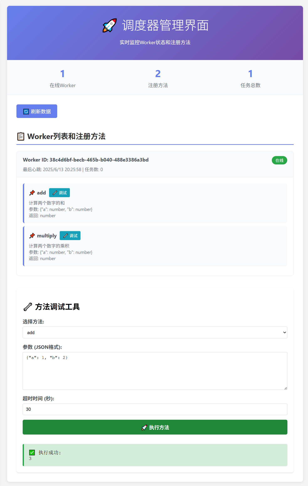

# Go 分布式任务调度系统

## 📋 快速导航

- [核心特性](#核心特性)
- [核心理念](#核心理念)
- [项目结构](#项目结构)
- [核心组件](#核心组件)
- [系统交互流程](#系统交互流程)
- [快速开始](#快速开始)
- [高级功能](#高级功能)
- [TODO](#todo)

---
### Web UI



这是一个基于 Go 语言实现的轻量级分布式任务调度系统，支持 WebSocket 实时通信、负载均衡、方法文档化和 Web UI 调试功能。旨在通过将任务分发到多个 Worker 节点并行处理，从而解决单台计算机在处理计算密集型或 I/O 密集型任务时可能遇到的性能瓶颈问题。

## 核心特性

- 🚀 **实时通信**：基于 WebSocket 的调度器与 Worker 通信
- ⚖️ **负载均衡**：智能任务分配，支持多 Worker 负载均衡
- 📚 **方法文档化**：支持为注册的方法添加详细文档说明
- 🎯 **Web UI 调试**：内置 Web 界面，支持实时监控和方法调试
- 🔄 **自动重连**：Worker 断线自动重连机制
- 💓 **心跳检测**：实时监控 Worker 节点状态
- 🛡️ **并发安全**：解决 WebSocket 并发写入问题

## 核心理念

本项目的核心理念是将复杂的任务分解为更小的、可独立执行的工作单元，并通过一个中心化的调度器（Scheduler）将这些工作单元分发给一组工作节点（Worker）。客户端（Client）可以向调度器提交任务请求，并获取任务执行结果。

这种架构的优势在于：

*   **可伸缩性**：可以通过增加 Worker 节点的数量来提高系统的整体处理能力
*   **灵活性**：不同的 Worker 可以执行不同类型的任务，方便横向扩展特定功能
*   **容错性**：单个 Worker 节点的故障不会影响整个系统的运行
*   **可观测性**：通过 Web UI 实时监控系统状态和调试方法

## 项目结构

```
├── examples/         // 示例代码
│   ├── client/       // 客户端示例
│   │   └── main.go
│   ├── scheduler/    // 调度器示例
│   │   └── main.go
│   └── worker/       // Worker 示例
│       └── main.go
├── image/            // 项目相关图片
├── schedulersdk/     // 客户端与调度器交互的 SDK
│   ├── client.go
│   └── retry_client.go
├── workersdk/        // Worker 与调度器交互的 SDK
│   ├── call.go
│   └── worker.go
├── go.mod            // Go 模块文件
├── go.sum            // Go 模块校验和文件
├── index.html        // Web UI 界面（嵌入在 scheduler.go 中）
└── scheduler.go      // 调度器核心逻辑实现（包含 Web UI）

## 核心组件

### 1. 调度器 (Scheduler)
**文件**: `scheduler.go`, `schedulersdk/`

**主要功能**:
- 🌐 **Web UI 管理界面**: 提供实时监控和调试功能
- 📡 **WebSocket 通信**: 与 Worker 节点建立持久连接
- ⚖️ **负载均衡**: 根据 Worker 负载智能分配任务
- 💓 **健康检查**: 定期检测 Worker 节点状态
- 📊 **任务管理**: 跟踪任务状态并返回结果

**API 端点**:
- `GET /` - Web UI 管理界面
- `GET /api/status` - 获取系统状态
- `POST /api/execute` - 执行任务
- `GET /api/result/{taskId}` - 获取任务结果
- `WS /api/worker/connect` - Worker 连接端点

### 2. 工作节点 (Worker)
**文件**: `workersdk/`, `examples/worker/`

**主要功能**:
- 🔌 **自动连接**: 自动连接到调度器并注册方法
- 📚 **方法文档**: 支持为注册方法添加详细文档
- 🔄 **自动重连**: 连接断开时自动重连
- 💓 **心跳保持**: 定期发送心跳维持连接
- 🛡️ **并发安全**: 解决 WebSocket 并发写入问题

**示例方法注册**:
```go
worker.RegisterMethod("add", addNumbers,
    "计算两个数字的和",
    "参数: {\"a\": number, \"b\": number}",
    "返回: number")
```

### 3. 客户端 (Client)
**文件**: `schedulersdk/`, `examples/client/`

**主要功能**:
- 📤 **任务提交**: 向调度器提交任务请求
- 🔍 **状态查询**: 查询任务执行状态
- 📥 **结果获取**: 获取任务执行结果
- 🔄 **重试机制**: 支持自动重试失败的请求

**使用示例**:
```go
workersdk.Call("http://localhost:8080", "add", map[string]any{
    "a": 1,
    "b": 2,
}, nil)
```

## 交互流程

1. **启动调度器**: 调度器启动并监听端口 8080，提供 Web UI 和 API 服务
2. **Worker 注册**: Worker 节点通过 WebSocket 连接到调度器并注册可用方法
3. **任务提交**: 客户端通过 API 或 Web UI 提交任务请求
4. **负载均衡**: 调度器根据 Worker 负载选择最优节点执行任务
5. **任务执行**: Worker 接收任务并执行相应的业务逻辑
6. **结果返回**: Worker 将执行结果返回给调度器，调度器再返回给客户端
7. **实时监控**: 通过 Web UI 实时查看系统状态和调试方法

## 快速开始

### 前提条件

- Go 1.19+ (请根据 `go.mod` 文件中的版本安装)

### 1. 启动调度器

```bash
go run examples/scheduler/main.go
```

调度器启动后会显示：
```
Scheduler started on :8080
Web UI available at: http://localhost:8080
```

### 2. 启动 Worker

```bash
go run examples/worker/main.go
```

Worker 启动后会自动连接到调度器并注册方法。

### 3. 使用 Web UI

打开浏览器访问 `http://localhost:8080`，你可以：

- 📊 **实时监控**: 查看 Worker 状态、方法列表和任务统计
- 🔧 **方法调试**: 选择方法、输入参数、执行并查看结果
- 📚 **查看文档**: 查看每个方法的详细文档说明

### 4. 使用客户端 API

```bash
go run examples/client/main.go
```

或者直接调用 API：
```bash
curl -X POST http://localhost:8080/api/execute \
  -H "Content-Type: application/json" \
  -d '{"method":"add","params":{"a":1,"b":2}}'
```

## 高级功能

### Web UI 调试

Web UI 提供了强大的调试功能：

1. **方法选择**: 从下拉列表中选择要调试的方法
2. **参数输入**: 以 JSON 格式输入方法参数
3. **超时设置**: 设置任务执行超时时间
4. **实时结果**: 查看任务执行状态和返回结果
5. **错误处理**: 显示详细的错误信息

### 负载均衡

调度器会自动根据以下策略进行负载均衡：
- 选择当前任务数最少的 Worker
- 确保 Worker 支持请求的方法
- 实时更新 Worker 负载状态

### 方法文档化

在注册方法时可以添加详细文档：
```go
worker.RegisterMethod("methodName", handler,
    "方法描述",
    "参数说明",
    "返回值说明")
```

## TODO

- [ ] 支持调度器集群模式
- [ ] 添加任务优先级
- [ ] 支持任务队列持久化
- [ ] 添加更多监控指标
- [ ] 支持方法版本管理

## 贡献

欢迎提交 Pull Request 或 Issue。